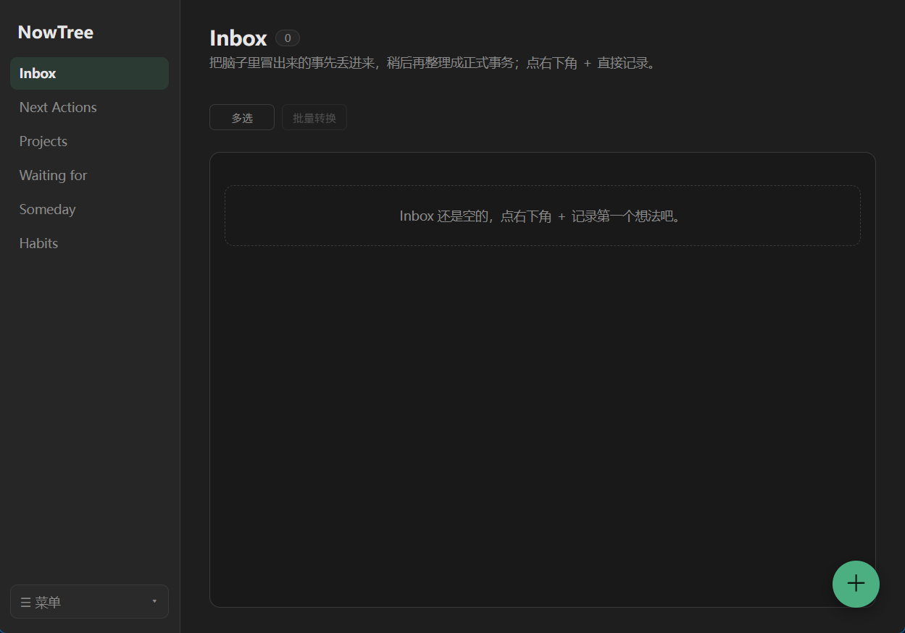
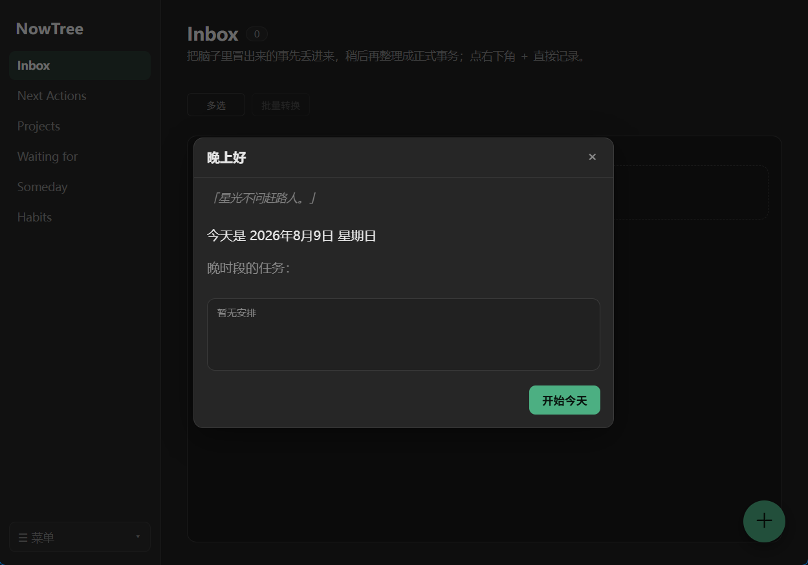
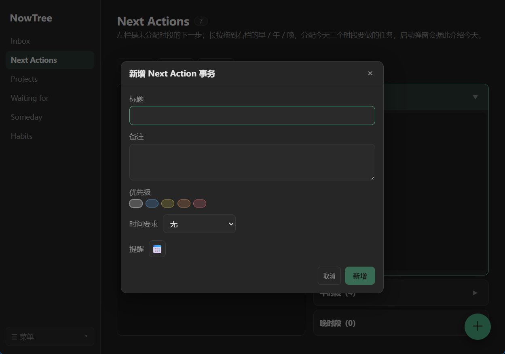
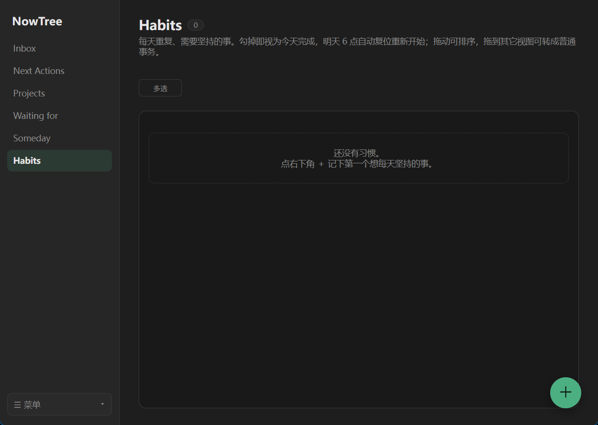

# NowTree

> **Local-first GTD Personal Action Management System** · 本地优先的个人事务管理工具  
> 一个 **React + TypeScript + Tauri + Rust + SQLite** 的桌面应用实践项目

种一棵树最好的时间是十年前，其次是现在。NowTree 帮你把脑子里漂浮的灵感先丢进收集箱，再慢慢整理成可执行的下一步。

---

## 🌱 Why NowTree

很多任务管理工具擅长帮你**记录**任务，却止步于此：清单越写越长，真正被推进的却很少。NowTree 选择站在 GTD（Getting Things Done）的一边——它关心的不是「你记了多少」，而是「你下一步要做什么」。

NowTree 的工作流遵循一条朴素的闭环：

> **Inbox 收集 → Clarify 整理 → 分派到 Next Actions / Project / Waiting / Someday → 完成与回顾**

一句话概括它的产品理念：

> **先捕获，再整理；先明确下一步，再推进长期目标。**

- **先捕获**：灵感、待办、杂念，先无条件丢进 Inbox，不要求当场想清楚，先把脑子清空。
- **再整理**：空闲时回看收集箱，把每条东西澄清成具体的下一步、一个项目、或暂不处理的事。
- **先明确下一步**：Project 再大，也拆成此刻能执行的单步；Someday 再诱人，也先放一边，不被它绑架。
- **再推进长期目标**：当长期目标被拆成可执行的下一步，它才真正开始往前走。

NowTree 是 **local-first** 的：数据只存在你本机，不强制联网、不上云（当前版本无云同步)。对个人开发者而言，这意味着隐私可控、离线可用，也意味着它还是一个可以随意读源码、改着玩的开源练习项目。

---

## ✨ 功能特性

- **Inbox 快速收集**：一键记下标题 / 备注，先丢进收集箱，稍后再整理，不打断当下。
- **整理转换**：把收集箱里的灵感原地转为四类正式事务——`Next Actions` / `Project` / `Waiting for` / `Someday`，不新建重复记录（需要时还可进一步转成 `Habits`）。
- **五类视图 + Project 树**：
  - `Next Actions`：今日 / 本周 / 本月 / 具体日期的时间要求，并按早 / 午 / 晚三个时段规划一天。
  - `Project`：项目可拆分子事务，子事务可手动「加入 Next」进入全局下一步。
  - `Waiting for` / `Someday`：等待他人、将来也许做的事。
  - `Habits`：每日重复需要坚持的事项，完成后次日 **06:00 自动重置**，循环打卡。默认不进 Next，避免占用 GTD 主线。
- **回收站**：软删除进回收站，可单条恢复 / 彻底删除 / 清空；恢复父项目会连带拉回其祖先链，绝不产生孤儿。
- **数据管理**：一键导出 / 导入 JSON 备份（文件名带日期，导入前显示备份时间与条数确认），方便换机迁移。
- **提醒**：为事务设置提醒时间，到点在桌面弹系统通知。
- **开机自启动 / 最小化到托盘**：关闭窗口默认收进系统托盘（进程存活、提醒照常），可一键退出。
- **深浅主题**：深色 / 浅色 / 跟随系统，平滑切换。
- **拖拽排序**：长按整条事务拖动重排；跨视图可拖到左侧导航栏改类别；Project 内可拖拽改父。
- **快捷键**：`1`–`6` 切换视图，`Enter` 快速新增 / 保存，`Esc` 关闭弹窗。

---

## 🖥️ 界面截图

| Inbox 收集箱 | 今日启动弹窗 | 新增事务弹窗 | Habits 习惯 |
|---|---|---|---|
|  |  |  |  |

> 当前截图均为深色主题。浅色主题可在设置中一键切换。

---

## 🧱 技术栈

这是一个以 **React + TypeScript + Tauri + Rust + SQLite** 为核心的本地优先桌面应用实践项目。

| 层 | 技术 |
|---|---|
| 桌面外壳 | **Tauri v2**（Rust） |
| 前端 | **React 18** + **TypeScript** + **Vite** |
| 状态管理 | **Zustand** |
| 本地数据库 | **SQLite**（Rust `rusqlite`，数据存于本机 `AppData`） |
| 后端 | Tauri 命令（`src-tauri/src/commands.rs`） |

---

## 🚀 快速开始

### 前置依赖

- **Node.js** ≥ 22（建议用管理版本，本项目用 22 / 24 验证过）
- **Rust** 工具链（`cargo`、`rustc`）
- **MSVC 构建工具** + **Windows SDK 10**（Windows 编译 Rust 必需）
- **Microsoft Edge WebView2 运行时**（Win10/11 一般已自带；Tauri 窗口依赖它）
- 若要打包成安装包（`.msi`），需额外安装 **WiX Toolset v3.x**（本项目用 v3.14.1 验证；注意不是 WiX v4，Tauri v2 认 v3 的 `candle` / `light`）

### 开发模式（热重载）

```bash
# 方式一：直接双击（脚本在 scripts/ 目录）
scripts/run-dev.bat

# 方式二：终端
npm install
npm run tauri dev
```

### 构建发布包

```bash
# 方式一：双击（脚本在 scripts/ 目录，已内置非标准 MSVC / SDK 路径）
scripts/build-release.bat

# 方式二：终端
npm install
npm run tauri build
```

输出位置：

- 松散可执行文件：`src-tauri/target/release/NowTree.exe`（可直接双击运行，发给别人也能用）
- Windows Installer 包：`src-tauri/target/release/bundle/msi/NowTree_1.1.0_x64_en-US.msi`
- NSIS 安装包：`src-tauri/target/release/bundle/nsis/NowTree_1.1.0_x64-setup.exe`

> 本机已安装 WiX Toolset v3.14.1 与 NSIS，因此 `build-release.bat` 会同时产出上述三种产物。若只想拿到可直接双击的 exe，取 `NowTree.exe` 即可。
>
> ⚠️ 本仓库提供的 `build_tauri.bat` 只编译 Rust 侧（`cargo build`），**不打包、不出安装包、也不弹窗口**，仅用于快速验证 Rust 能否编译通过。日常开发请用 `run-dev.bat`，出成品用 `build-release.bat`。

---

## 💾 数据说明

- 数据存于本机：`C:\Users\<你>\AppData\Roaming\com.nowtree.app\nowtree.sqlite`。
- 数据**完全本地**，不上云、不联网（当前版本无云同步）。
- 换机 / 重装前，请用左侧菜单「数据管理 → 导出」备份；到新机器「导入」即可迁移。
- `dev` 模式与 `release` 成品使用同一份数据库（同一 `identifier`），数据互通。

---

## ⌨️ 快捷键

| 按键 | 作用 |
|---|---|
| `1` / `2` / `3` / `4` / `5` / `6` | 切换 Inbox / Next Actions / Projects / Waiting for / Someday / Habits |
| `Enter` | 非输入态下快速新增当前视图事务；弹窗内保存 |
| `Esc` | 关闭当前弹窗 |
| 长按拖拽（约 220ms） | 拖动事务排序 / 跨类别 / 改父 |

---

## 📁 目录结构

```
NowTree开发/
├── src/                      # 前端（React + TS）
│   ├── components/           # 视图与弹窗组件
│   ├── hooks/               # 拖拽、生命周期等逻辑
│   ├── store/               # Zustand 全局状态
│   ├── services/            # 纯业务逻辑（类别迁移、来源文案等）
│   ├── data/               # 数据访问层（Repository 抽象）
│   ├── types/              # 类型定义（Transaction / 枚举）
│   └── styles/             # 全局样式（深浅主题变量）
├── docs/                    # 设计文档与截图
│   ├── ARCHITECTURE.md      # 架构说明
│   ├── Habits Feature Design.md  # Habits 视图设计
│   └── screenshots/         # 界面截图
├── src-tauri/              # 后端（Rust + Tauri）
│   ├── src/
│   │   ├── commands.rs     # Tauri 命令（增删改查 / 导入导出 / 托盘）
│   │   ├── db.rs           # SQLite 连接与建表
│   │   └── lib.rs         # 应用入口、托盘、插件注册
│   ├── Cargo.toml
│   └── tauri.conf.json     # 应用配置（含打包设置）
├── scripts/               # 构建脚本（Windows 双击）
│   ├── build-release.bat   # 出成品（tauri build）
│   ├── run-dev.bat         # 开发热重载
│   ├── build_tauri.bat     # 仅编译 Rust 侧（诊断用）
│   └── regression_db.py    # 数据库自检（状态分布 / 孤儿 / 软删）
├── CHANGELOG.md            # 版本变更记录
└── README.md
```

更详细的设计与数据流见 [docs/ARCHITECTURE.md](docs/ARCHITECTURE.md)。

---

## 🧭 已知限制

- **提醒需程序运行**：提醒在前端 30 秒轮询触发，窗口最小化到托盘时仍会响；但若「退出」程序，进程终止后不再提醒（彻底退出后仍提醒需 OS 级定时，暂未做）。
- **安装包产物**：`build-release.bat` 同时输出松散 `NowTree.exe`、WiX `.msi` 与 NSIS `setup.exe`（需本机已安装 WiX v3 与 NSIS）。
- **暂未做云同步 / 手机端**：当前为纯本地桌面。架构已预留 Repository 接口，将来可加云端实现。

---

## 🗺️ Roadmap

下面不是版本号的流水账，而是从「产品目标」角度重新归纳的发展路线。NowTree 早期版本号比较随意（有些小修小补也升了版本，有些较大的功能又没明显体现版本变化，部分版本由 AI 辅助建议产生），后续会尽量遵循 [语义化版本](https://semver.org/lang/zh-CN/)（主版本.次版本.修订号）来标注变更。

### 阶段一 · MVP —— GTD 核心闭环（已完成，≈ 0.1.0–0.1.15）
目标：跑通「收集 → 整理 → 执行 → 回顾」的最小可用闭环。
- Inbox 快速收集，先记下来再整理
- 整理转换：原地转成 Next Actions / Project / Waiting / Someday 四类
- 四类视图 + Project 树，子事务可手动「加入 Next」
- 回收站软删除、单条恢复 / 彻底删除 / 清空
- 数据导入导出（换机迁移）、深浅主题、拖拽排序、快捷键

### 阶段二 · 功能完善 —— 数据安全、交互体验、桌面能力（已完成，≈ 0.1.16–0.2.0）
目标：在闭环可用之后，补齐工程地基与桌面体验。
- **数据层**：每条事务加 `sync_id`（UUID）+ `deleted_at`，为将来同步铺路；业务规则收口到 service 层；拖拽逻辑复用 `dragUtils`；补 vitest 单测；Rust 端做标题校验
- **交互**：跨类别拖拽重分类、Project 改父、deadline 自动归一、启动弹窗、弹窗统一居中、字号收敛
- **桌面能力**：系统托盘 + 最小化到托盘、开机自启动、到点的系统通知提醒

### 阶段三 · v1.0 产品化（已完成，2026-07-25）
目标：稳定下来，真的能交给用户日常使用。
- 回归清单修复（导航焦点、拖拽自动滚动、回收站恢复 SQL、Inbox 删除确认态等）
- 导出 / 导入增强（带日期文件名、两步导入确认）
- 版本号四处同步、产出可安装包（.msi / NSIS / 松散 exe），打 v1.0.0 标签

### 阶段四 · v1.1.0 —— Habits 每日打卡（已完成）
目标：把重复性例行项从 GTD 主线中剥离，每天自动循环。
- 新增第五视图 Habits，仅展示 `category='habit'` 的事务，默认不进 Next
- 完成即灰显，次日 **06:00** 自动重置回未完成
- 可拖拽排序、软删除、跨视图与普通事务互转
- 编辑时隐藏优先级与时间要求，保留备注与一次性提醒

更详细的设计决策见 [docs/Habits Feature Design.md](docs/Habits%20Feature%20Design.md)。

### 阶段五 · 未来方向（规划中，尚未立项）
目标：从「单人单机」走向「更聪明、更多端」。以下仅为方向性设想，不承诺排期：
- **移动端收集 + 云同步**：手机端（微信小程序 / APP）随手记，经云端后端与桌面双向同步；数据访问层已用 Repository 接口抽象，加云实现相对低成本
- **统计 Stats 视图**：按完成时间聚合的日报 / 年热力图 / 连续打卡（streak），让回顾看得见
- **AI 辅助（轻量）**：基于本地模型或可选云端，对 Inbox 批量建议「下一步」、辅助分类；仍坚持 local-first 原则，敏感数据默认不出本机

> 方向能否落地，取决于使用反馈与个人维护精力。欢迎在 Issues 里提想法。

---

## 📜 许可证

[MIT](LICENSE) © NowTree
